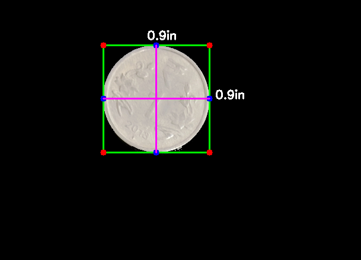
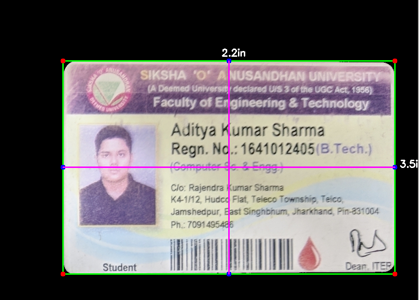

# Object-Deimension-Finder
A Image Processing Python Code to find the 2d dimensions of the objects.

It needs a reference image size , so it can find the distance from the lens, to the objects and then it can tell the dimensions of the objects.

# Screenshot of the working 

